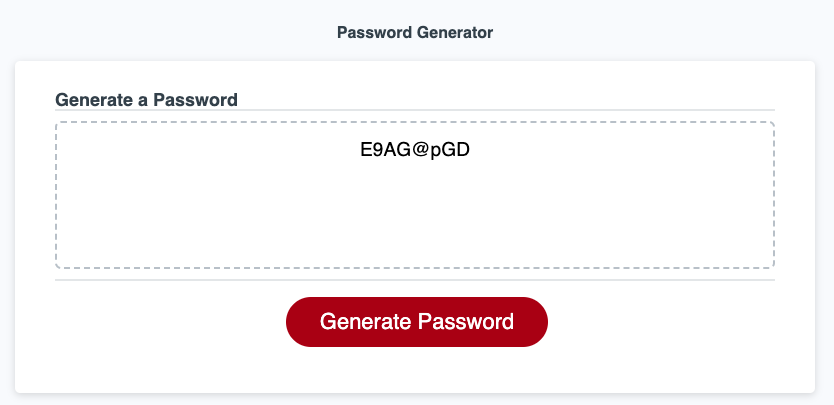

# Random Password Generator
An application to generate a random password.

## Deployment link

https://elibrer.github.io/password-generator

## Description

This repository contains the code base for a random password generator. This application can be utilised by the user to create a strong password with the choice of various character combinations and password length. 

The password generator shows off the skills I have gained in Javascript so far, with functions and loops allowing the user to change variables on the fly as they please. 

## Table of Contents (Optional)

- [Features](#features)
- [Usage](#usage)
- [Languages Used](#languages-used)
- [Home Page Preview](#full-preview)
- [Credits](#credits)

## Features

- When the generate password button is pressed, the user is given various prompts to adjust variables.
- When asked for the password length, a user can input exactly how long they want their password to be.
- When a user has selected the length, four options for 'uppercase', 'lowercase', 'numeric', and 'special' characters are shown. The user may choose any or all if they'd like.
- If no character types are selected, a prompt will appear informing the users that they cannot continue until at least one type is selected, and return them to the first option.
- Once any of the character types has been selected, the program will then generate a password that includes at LEAST one of the chosen character types, at the length chosen, and randomised in the final display so that the character types aren't in the same order every time.
- If the cancel button is pressed at any point during the applications use, the program will be terminated.

## Usage

This application is designed to help users create a strong password that they can use for their own personal use. Having a strong password is essential when browsing the internet, so this tool would be considered quite useful.

## Languages Used
- ### **HTML**
- ### **CSS**
- ### **JavaScript**

## Home page preview

## Credits

### *Resources utilised from various websites:*

[Glossary of Semantics](https://developer.mozilla.org/en-US/docs/Glossary/Semantics)

[Best practices for creating quality meta descriptions](https://developers.google.com/search/docs/appearance/snippet)

[Input tags](https://www.w3schools.com/tags/tag_label.asp)

[Telephone input type](https://www.w3schools.com/tags/att_input_type_tel.asp)

[Creating links in a README.md file](https://docs.readme.com/main/docs/linking-to-pages)

[Badge generator](https://shields.io/)